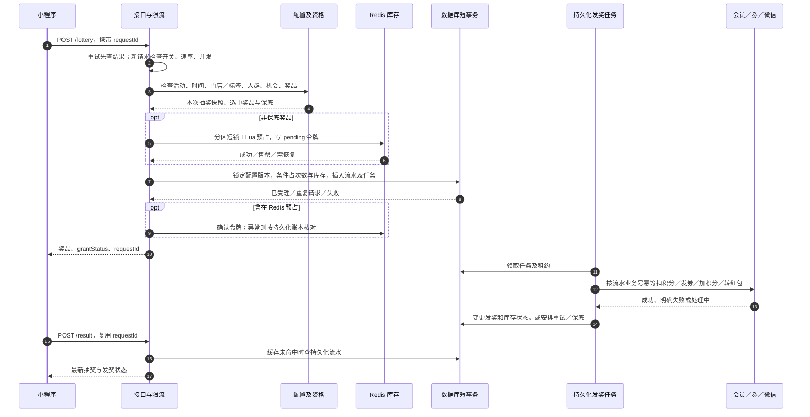

# 抽奖 V2 改造说明：前后差异、活动设置与并发链路

> 按 2026-09-29 仓库代码整理。本文说明当前实现和设计原因；压测容量、真实微信与生产环境效果仍需部署验证。数据库脚本仅供审核执行。

## 一、改造目标和前后差异

旧流程已有抽奖、任务、奖品、红包等能力，但门店标签、缓存库存、数据库剩余量和远程发奖各自维护状态。请求超时后也难以判断抽奖是否已经受理。V2 把“资格校验 → 快速预占 → 数据库受理 → 异步发奖 → 结果查询”分为清晰的阶段：Redis 承担热点预占和读取，数据库保留最终账本与唯一约束。**抽奖仍有必要的数据库短事务，不是纯 Redis 抽奖。**

| 维度 | 原有流程 | V2 当前做法 | 这样设计的原因 |
| --- | --- | --- | --- |
| 参与范围 | 以门店关系为主，标签变化调用原活动同步方法 | `appScope=0` 按门店，`1` 按标签；保存标签、解析门店，抽奖时再向 system 核对标签 | 展示范围可预计算，实际资格随门店标签变化 |
| 活动标识 | 活动主表 ID、抽奖配置 ID 在不同缓存中使用 | 配置 ID 映射到活动 ID；V2 缓存键包含项目 ID 和活动主表 ID | 避免两套可变库存和跨项目串数据 |
| 奖品与库存 | 旧奖品 `remain_num`、原缓存及日志相互配合 | 稳定 `code` 和库存批次；Redis Lua 预占，`lottery_v2_stock` 条件更新 | 快速挡住热点竞争，Redis 异常后可从账本恢复 |
| 抽奖机会 | 旧次数／任务路径 | 总量、周期、来源分别建账，条件更新；Redis 保存查询快照 | 防并发覆盖，兼容免费、积分、下单、分享、浏览组合 |
| 请求重试 | 超时可能再次抽奖 | 同一次点击复用 `requestId`，唯一约束和结果查询防重 | 避免重扣机会、重占库存和重复发奖 |
| 发奖 | 原同步或共享异步路径 | 受理事务只记录流水和待处理任务，有界 worker 异步处理 | 不持数据库事务等待微信／会员接口，重启后继续 |
| 红包 | 外部超时结果难确认 | 商户单号先持久化；查单优先，处理中保留库存，验签回调唤醒任务 | 未确认终态前不错误释放或重复转账 |
| 缓存更新 | 多入口各自清理／写入 | 配置版本发布、持久化刷新任务、提交后更新及失败重试 | 防旧任务覆盖新配置，不因范围变化清零库存 |

核心代码：[小程序入口](../youdao-module-promotion/youdao-module-promotion-biz/src/main/java/com/htyoudao/youdao/module/promotion/controller/app/lottery/AppLotteryController.java)、[V2 抽奖服务](../youdao-module-promotion/youdao-module-promotion-biz/src/main/java/com/htyoudao/youdao/module/promotion/service/lottery/v2/impl/LotteryV2ServiceImpl.java)、[持久化账本](../youdao-module-promotion/youdao-module-promotion-biz/src/main/java/com/htyoudao/youdao/module/promotion/service/lottery/v2/impl/LotteryLedgerImpl.java)。

## 二、不同活动设置如何组合

这些设置彼此独立，可组成“标签范围＋独立奖池＋场次次数＋分享机会”等活动。`lotteryType=1/2/3/4` 分别为转盘、九宫格、福袋、盲盒，主要是展示形态；受理原则相同。管理端新增、修改、详情都携带 `appScope`、`tagIds`。

| 设置 | 规则 | 对并发／库存的影响 |
| --- | --- | --- |
| 范围 | `appScope=0`：原“全部门店”或指定门店；`appScope=1`：多个标签**命中任意一个**即可 | `activity_store_tag` 存标签配置；解析去重后的门店存 `activity_store`。标签零命中仍可保存奖品模板 |
| 展示与资格 | `publicButton=0` 的已启用 V2 活动进入门店展示列表；实际抽奖还检查活动日期／时间段、门店和会员人群资格 | 列表只用于展示，不能代替抽奖时的最终资格判断 |
| 门店标签变化 | system 提交标签变更后通知原 `ActivityApi.updateActivityStoreByTagIdAndStoreId`；抽奖实时调用 `StoreApi.matchStoreTagCache` | 退出后停止新参与；同批次重新加入复用原奖品 `code`、已用量和剩余量；标签核对异常不放行 |
| 奖池 | `prizePoolRules=1` 所有门店共用池（门店池 ID 为 0）；`=2` 每店独立池 | 独立池按门店隔离。切换共用／独立模式时需先确认没有待处理请求，并创建新库存批次 |
| 奖品 | 每池必须有且仅有一个保底奖品；普通奖品配置概率、总量、稳定 `code`，可设城市、是否可重复、`minimumNumber` | 保底不占普通库存；总量不能小于已发放加预占。未到累计开奖门槛不进概率池；选中奖品缺货则回保底 |
| 机会来源 | 旧单方式 `lotteryMethod=1/2/3` 对应免费／积分／下单；开启任意免费、积分、下单、分享、浏览开关则进入组合模式 | 组合模式依次尝试免费、下单、分享、浏览、积分；仍受总量和周期限额约束。积分在异步发奖任务中按流水号幂等扣减 |
| 次数周期 | `lotteryTotalNumber` 为会员总次数，`lotteryLimit` 为日／场次次数；`calculationRules=1` 按天，`=2` 按场次时间段 | 周期键按日期或日期＋场次隔离；任务来源可按设置使用周期键或 `TOTAL` |
| 正常场次重置 | `lotteryRulesReset=1` 且活动启用、日期有效、当前不在场次中并满足下场次间隔时，原定时任务触发 V2 `reset`；`lastResetScope` 防重复 | 新请求进入新 `stockEpoch`；旧请求的确认、退奖、补偿仍操作旧批次 |
| 停用／再启用 | 停止新受理；已受理任务仍继续 | V2 再次启用不清零。旧活动首次停用后重启才初始化新流程 |

例子：独立门店某奖品总量 10，已发放 3；门店退出标签后不再参与，重新加入**同一批次**仍只剩 7。修改参与范围只提高 `configVersion`，不创建新 `stockEpoch`。

实现见[范围与奖品维护](../youdao-module-promotion/youdao-module-promotion-biz/src/main/java/com/htyoudao/youdao/module/promotion/service/lottery/v2/impl/LotteryScopeServiceImpl.java)、[机会及场次计算](../youdao-module-promotion/youdao-module-promotion-biz/src/main/java/com/htyoudao/youdao/module/promotion/service/lottery/impl/LotteryMobileServiceImpl.java)、[次数计算](../youdao-module-promotion/youdao-module-promotion-biz/src/main/java/com/htyoudao/youdao/module/promotion/service/lottery/v2/LotteryQuota.java)。

## 三、一次抽奖的完整并发链路

### 3.1 入口、限流和资格

小程序路径为 `/promotion/lottery-mobile/lottery` 和 `/promotion/lottery-mobile/result`。V2 要求 `lotteryId`、`memberId`、`storeId`、`requestId`；请求号限 8–64 位字母、数字、下划线、短横线。同一次点击的网络重试必须复用它；下一次真实抽奖才生成新值。相同请求号更换门店会拒绝。结果缓存过期后仍查询持久化流水，绝不重新抽奖。

新抽奖先经过集群、活动、会员速率限制，以及实例并发和数据库连接预算；普通查询、结果查询、任务、回调有独立容量。超限即拒绝，未受理不占次数／库存。Redis 故障时暂停新抽奖，结果查询和回调保留受控本地名额。资格校验复用活动状态、时间、人群、企微及门店判断；标签范围额外实时请求 system。配置缓存缺失时使用短锁和回源并发上限，拥挤时返回繁忙，不让所有请求排队查库。

### 3.2 Redis 预占与数据库最终约束

库存键形如 `lottery:v2:{b<项目ID>:a<活动主表ID>}:stock:<批次>:<门店池>:<奖品code>`。同一 Lua 操作的键具有相同 Redis Cluster hash tag。库存 Hash 含 `total/used/revision/configVersion/pending`；奖品展示缓存不存可作为扣减依据的剩余量。短锁只覆盖单一库存分区的预占与短事务，不覆盖远程发奖。

Lua 原子检查版本、剩余量、`pending` 后执行 `used+1` 并留下令牌。数据库事务再核对 `configVersion/stockEpoch/runtimeVersion/state`，用条件更新保证 `reserved + issued < total`；同时条件占总次数、周期次数和机会来源，插入唯一流水及发奖任务。这保证持久化约束 **已发放＋已预占 ≤ 库存总量**。正常热缓存预占／确认不额外读取库存账本，但整次抽奖仍有防重、配置校验和持久化写入。

Redis 缺失、版本变化、异常值或残留 `pending` 时，持单分区锁从数据库库存账本恢复；账本缺失就拒绝。事务提交结果不确定时先查同 `requestId` 流水，已受理不能因 Redis 确认失败回退库存。重复请求返回同一流水；奖品缺货或禁止重复领取时回保底。配置修改只切版本，不重置已有库存、次数和幂等记录。

### 3.3 异步发奖和红包

受理时写 `lottery_v2_request`、`lottery_v2_job` 和固定商户单号；有界 worker 领取任务，租约过期可重领，服务重启后继续。外部会员／优惠券／微信调用均在数据库事务外，使用流水业务号做幂等。当前奖品类型代码中，`1` 是优惠券、`2` 是积分、`3` 是实物、`5` 是红包；其他类型沿用现有奖品逻辑。实物退奖由独立任务按原流水批次返还一次。

红包先按持久化商户单号查单，只有微信明确返回 `NOT_FOUND` 才发起转账。`PROCESSING`、等待用户确认及超时是未知／处理中：保留库存、安排重试与查单；验签回调唤醒任务。明确成功才将预占转已发放；明确失败才释放或切保底。已发奖后即使日志同步失败，也只重试日志，不能退库存或再发一遍。前端直接展示 lottery 返回的奖品，不再返回 drawStatus。grantStatus 仅用于领取和发放进度展示，不要求抽奖页等待发奖；result 只查询结果，不触发人工补发。

实现见[准入控制](../youdao-module-promotion/youdao-module-promotion-biz/src/main/java/com/htyoudao/youdao/module/promotion/service/lottery/v2/LotteryAdmission.java)、[库存缓存](../youdao-module-promotion/youdao-module-promotion-biz/src/main/java/com/htyoudao/youdao/module/promotion/service/lottery/v2/LotteryStockCache.java)、[任务执行](../youdao-module-promotion/youdao-module-promotion-biz/src/main/java/com/htyoudao/youdao/module/promotion/service/lottery/v2/LotteryGrantWorker.java)、[红包网关](../youdao-module-promotion/youdao-module-promotion-biz/src/main/java/com/htyoudao/youdao/module/promotion/service/lottery/v2/LotteryCashGateway.java)。

## 四、缓存、标签同步与旧数据兼容

`configVersion` 表示配置版本，范围或模板变化时推进；`stockEpoch` 表示库存批次，只在正常场次重置或明确奖池切换时推进。配置 ID 映射、活动配置、门店活动列表、奖品展示、次数快照和请求结果各自缓存；终态结果默认缓存 24 小时，到期回查流水。库存、总次数及处理中请求不能按普通展示缓存 TTL 清理；活动结束且流水结清 7 天后，后台只按登记过的活动键集合分批清理，不全局扫描 Redis。配置更新事务内登记发布任务，提交后刷新，失败重试；旧版本不得覆盖新配置。

`system_activity_tag_outbox` 不是第二份标签数据。门店标签变更事务内记录待通知事项，提交后刷新 system 标签缓存、调用原有活动更新方法；失败定时重试。营销服务对 V2 活动按当前标签核对并调整 `activity_store`，旧活动仍由原同步路径处理。这样门店写事务不等待远程接口，也不因一次调用失败永久漏同步。

历史活动保持 `runtime_version=1`，不批量营销旧数据，也不改写旧库存和日志；仍启用的旧活动继续走原抽奖、列表、详情和管理逻辑。**旧活动停用后首次重新启用**时，在配置行锁与事务内补齐缺失的奖品 `code`／模板，按奖品配置总量创建新 `stockEpoch`，V2 `reserved/issued` 从零开始；旧 `remain_num`、日志、任务机会保留，但**旧消耗不导入新账本**。已经是 V2 的活动重复启用或停用再启用不再次清零。若标记旧版却已有 V2 请求／次数／库存，拒绝初始化，避免覆盖。切换前须暂停该活动旧请求、等待旧任务结束并核对历史库存，不能新旧实例并行写同一活动。

相关代码：[生命周期](../youdao-module-promotion/youdao-module-promotion-biz/src/main/java/com/htyoudao/youdao/module/promotion/service/lottery/v2/LotteryRuntimeLifecycle.java)、[门店通知](../youdao-module-system/youdao-module-system-biz/src/main/java/com/htyoudao/youdao/module/system/service/store/StoreActivityTagOutbox.java)、[兼容记录](lottery-v2-compatibility.md)。

## 五、上线材料与验证边界

统一发布脚本为 [lottery_release_all.sql](../sql/lottery_release_all.sql)。在对应实际库连接中选择 `@lottery_release_target`：`PROMOTION` 营销主库、`SYSTEM` 系统主库、`MEMBER` 会员物理分片库、`LOG` 中奖记录物理分片库；每次只执行所选类型，其他内容跳过。库名/实例按实际部署选择，不将所有表放入一个库。已存在的表、字段和索引不会被覆盖；人工补发权限新增后需另行给角色授权。配置见 [Nacos 示例](lottery-v2-nacos.example.yaml)。先发布表结构及权限，再发布营销、系统、会员服务；不要批量修改历史活动运行版本或清空库存。

上线验收至少验证：标签互切和零命中、动态加入退出；共享／独立池与 10 份已耗 3 份后重新加入；最后一份并发争抢、重复请求和重复退奖；Redis 重启、配置版本乱序；红包超时但微信已受理及回调乱序；场次切换时旧批次补偿。监控关注缓存命中／回源、P95/P99、连接等待、限流量、库存恢复次数、任务积压年龄和红包未知状态。已有本地编译与模拟回归记录见[兼容记录](lottery-v2-compatibility.md)；本文写作没有连接真实 MySQL、Redis Cluster 或微信，最终吞吐及故障恢复仍须在上线等价环境压测、联调和对账。
